# Speculative Decoding from Scratch (DSpark) — the written course

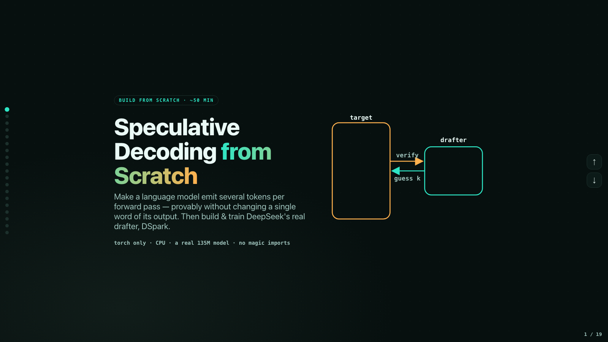

This is the full course as text: follow it top to bottom and you'll build
**lossless speculative decoding** from an empty file, then build and train
DeepSeek's real **DSpark** drafter — and benchmark it honestly against a dumb
baseline that turns out to win. Every number in here was measured on a laptop
CPU with the code in this repo. There's also a [video version](README.md) of
this exact build.

**The route, start to finish:**

0. Set up (2 min) — Python env, torch + transformers.
1. Load a real target model, write plain greedy decoding — the baseline we must match.
2. Build the dumbest drafter (a bigram table) + the **lossless verifier**, and *prove* byte-identical output.
3. Build DSpark's real drafter: parallel backbone + low-rank Markov thread, reusing the frozen target.
4. Train it by distillation (~1 min on CPU) and watch acceptance go 0% → ~30%.
5. Benchmark honestly against the free baseline — and get humbled, and understand why.

**How to use this file:** each chapter gives you the idea, then a **✏️ Task**
to write the code yourself, then the reference code (also in this repo as a
runnable file), then the output you should see. Type it — don't paste it. The
point of from-scratch is to be the person who can tell when the code is wrong,
and you'll meet a concrete example of exactly that in chapter 2.

---

## Step 0 — Setup

Two ways to follow:

- **From scratch (recommended):** make an empty folder and write every file
  yourself as you go. `pip install "torch>=2.2" "transformers>=4.44"`. Use this
  repo only to unstick yourself.
- **Follow-along:** `git clone https://github.com/vukrosic/dspark-from-scratch`
  and `pip install -r requirements.txt`, then read the files as you reach them.

No GPU needed; the model (`HuggingFaceTB/SmolLM2-135M`, ~270 MB download) runs
on CPU, and the training scripts cap torch at 3 threads so your laptop stays
cool. First model load downloads it automatically.

---

## Chapter 1 — Why generation is slow, and the trick

Large language models write one token at a time. To produce the next token, the
whole model runs top to bottom, then does it all again for the token after
that. To generate N tokens you pay N full forward passes, because each token
depends on the one before it:

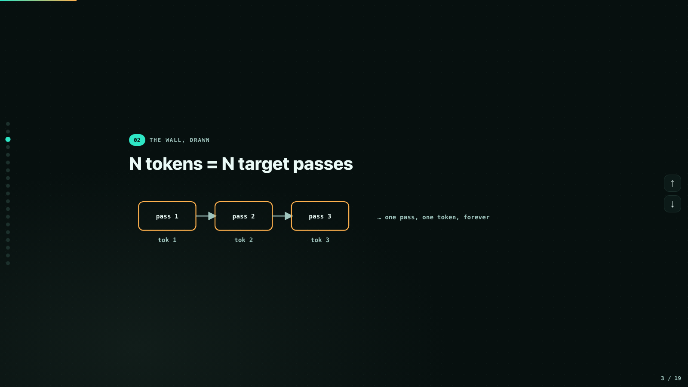

The trick: let a **cheap drafter** guess the next few tokens, then have the big
**target** model check all the guesses in **one** forward pass. A transformer
forward already produces logits at *every* position — so if we append 5 guessed
tokens and run one pass, we get the target's opinion at all 5 spots at once. We
keep the longest run of guesses the target agrees with and throw away the rest:

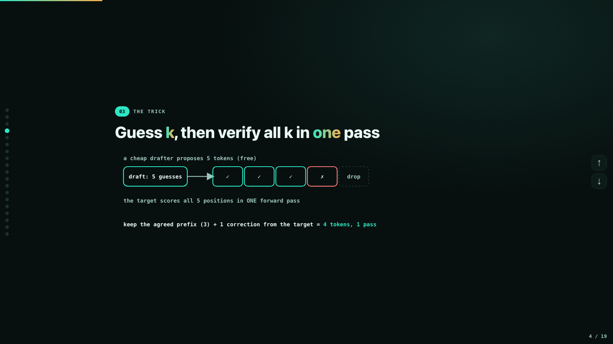

That's speculative decoding. Several tokens per pass instead of one — and, done
right, the output is **byte-identical** to plain decoding. That guarantee is
what we build first.

### ✏️ Task 1 — the target and the baseline

Create `spec_decode.py`. Load `HuggingFaceTB/SmolLM2-135M` (135M params, runs
on CPU), wrap it in one `target_logits(ids)` function, and write
`plain_greedy(ids, n)`: loop n times, argmax the last position's logits, append.

```python
import torch
from transformers import AutoModelForCausalLM, AutoTokenizer

MODEL = "HuggingFaceTB/SmolLM2-135M"
tok = AutoTokenizer.from_pretrained(MODEL)
target = AutoModelForCausalLM.from_pretrained(MODEL, torch_dtype=torch.float32).eval()

@torch.no_grad()
def target_logits(ids):
    """One target forward. ids (1, T) -> logits (1, T, vocab)."""
    return target(ids).logits

@torch.no_grad()
def plain_greedy(ids, n):
    for _ in range(n):
        nxt = target_logits(ids)[:, -1].argmax(-1, keepdim=True)
        ids = torch.cat([ids, nxt], dim=1)
    return ids
```

Sanity-check it produces real text:

```bash
python -c "from spec_decode import *; ids=tok('The capital of France is', return_tensors='pt').input_ids; print(tok.decode(plain_greedy(ids, 8)[0]))"
```

`plain_greedy` is the baseline **and the source of truth** — everything we
build must match its output exactly, token for token.

---

## Chapter 2 — A lossless verifier from scratch

Before a smart drafter, build the dumbest one that could possibly work —
because the **verifier** is the hard part, and we want to prove correctness
comes from the verifier, not from drafter luck.

### ✏️ Task 2 — the dumbest drafter

A bigram table: as text streams by, remember for each token what came after it
last time. To guess k tokens, follow that chain. No model, no training, free.

```python
class BigramDrafter:
    def __init__(self):
        self.nxt = {}

    def observe(self, ids):
        row = ids[0].tolist()
        for a, b in zip(row, row[1:]):
            self.nxt[a] = b            # last-seen successor wins

    def propose(self, ids, k):
        self.observe(ids)
        cur = int(ids[0, -1])
        out = []
        for _ in range(k):
            g = self.nxt.get(cur, cur) # fallback: repeat current token
            out.append(g)
            cur = g
        return torch.tensor([out], dtype=torch.long)
```

It will be wrong constantly. That's on purpose.

### The accept rule — the heart of the whole thing

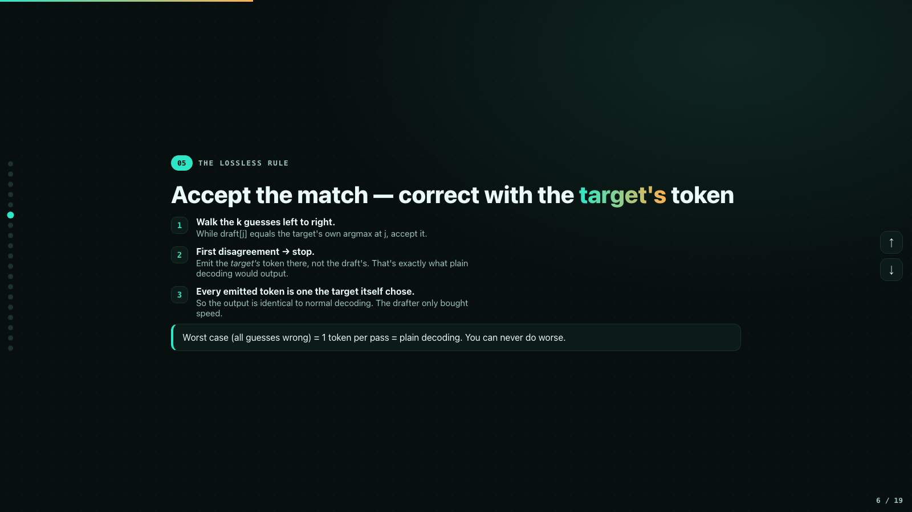

Each round:

1. The drafter proposes k tokens. Append them, run the target **once** over the
   whole block.
2. That one pass gives the target's own argmax pick at each of the k positions.
3. Walk left to right: while the draft equals the target's own pick, accept.
4. At the first disagreement, stop — and commit **the target's token there, not
   the drafter's**. That correction token is exactly what plain greedy decoding
   would have produced at that spot.

So every token we ever emit is a token the target itself would have chosen →
the output is *identical* to plain decoding. The drafter can only buy speed; it
can never change the answer. And each round commits at least 1 token
(accepted + 1 correction), so the worst case degrades to plain decoding — never
below it.

### ✏️ Task 3 — write the verifier

```python
@torch.no_grad()
def speculative_greedy(ids, n, drafter, k=4):
    produced = proposed_total = accepted_total = passes = 0
    while produced < n:
        draft = drafter.propose(ids, k)                 # (1, k)
        cand = torch.cat([ids, draft], dim=1)
        logits = target_logits(cand)                    # ONE pass over the block
        passes += 1
        t_arg = logits[:, -(k + 1):].argmax(-1)         # target's picks (1, k+1)

        acc = 0
        for j in range(k):
            proposed_total += 1
            if int(draft[0, j]) == int(t_arg[0, j]):
                acc += 1
            else:
                break
        accepted_total += acc
        # accepted prefix + the TARGET's correction token at position `acc`
        commit = torch.cat([draft[:, :acc], t_arg[:, acc:acc + 1]], dim=1)
        ids = torch.cat([ids, commit], dim=1)
        produced += acc + 1
    return ids, dict(proposed=proposed_total, accepted=accepted_total, passes=passes)
```

### ✏️ Task 4 — prove it

A speedup that changes your output is worthless, so we *assert* the guarantee.
Write `check_lossless.py`: run `plain_greedy` and `speculative_greedy` on a few
prompts and `torch.equal` the results:

```python
import torch
from spec_decode import BigramDrafter, plain_greedy, speculative_greedy, tok

PROMPTS = [
    "The key idea behind speculative decoding is",
    "Once upon a time, in a small village",
    "def fibonacci(n):",
]
N = 40

for p in PROMPTS:
    ids = tok(p, return_tensors="pt").input_ids
    base = plain_greedy(ids, N)
    spec, stats = speculative_greedy(ids, N, BigramDrafter(), k=4)
    same = torch.equal(base[:, : ids.shape[1] + N], spec[:, : ids.shape[1] + N])
    rate = stats["accepted"] / max(1, stats["proposed"])
    print(f"[{'OK ' if same else '!! MISMATCH'}] lossless={same}  "
          f"passes={stats['passes']}/{N}  accept={rate:.0%}  | {p!r}")
    assert same, f"LOSSLESS CONTRACT BROKEN for prompt: {p!r}"

print("\nAll prompts byte-identical to plain decoding. Lossless contract holds.")
```

Then:

```bash
python check_lossless.py
```

You should see (measured here):

```
[OK ] lossless=True  passes=25/40  accept=38%  | 'The key idea behind speculative decoding is'
[OK ] lossless=True  passes=40/40  accept=0%   | 'Once upon a time, in a small village'
[OK ] lossless=True  passes=25/40  accept=42%  | 'def fibonacci(n):'

All prompts byte-identical to plain decoding. Lossless contract holds.
```

Read that middle line carefully: on the prose prompt the bigram was **useless —
0% acceptance — and the output was still byte-identical**. That's the whole
guarantee. And on the technical prompts the dumb bigram already saved us 15 of
40 target passes, for free, with zero risk.

### ⚠️ Where AI gets this wrong

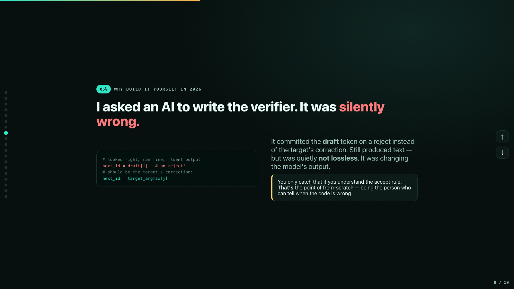

It's 2026 and you'll be tempted to have an AI write this verifier. We tried. It
produced something that *looked* right — but on a reject it committed the
**draft** token instead of the target's correction. It ran fine, produced
fluent text, and was silently NOT lossless: it was quietly changing the model's
output, with no error anywhere. `check_lossless.py` catches it instantly. You
only *write* `check_lossless.py` if you understand that the correction token is
load-bearing. That's why we build from scratch: not to type the code, but to be
the person who can tell when the code is wrong.

---

## Chapter 3 — DSpark's real drafter

The bigram is blind — it only knows "what usually follows this one token."
DSpark (DeepSeek's shipped drafter) is the smart-but-still-cheap guesser. Two
ideas:

**Idea 1 — semi-autoregressive drafting.** A normal draft *model* runs k serial
forwards to propose k tokens. DSpark runs **one** cheap backbone pass that
produces a base guess for all k positions at once (parallel → fast), then
threads a tiny low-rank "Markov" head through the block that only sees the
immediately preceding token (sequential → accuracy doesn't decay deep into the
block):

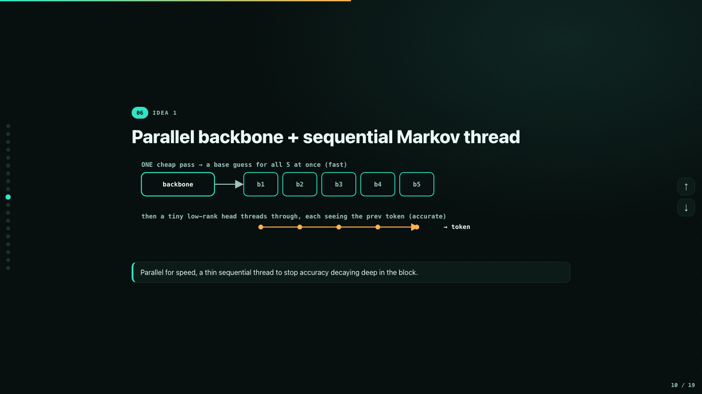

**Idea 2 — reuse the frozen target.** The drafter borrows the target's own
token embedding and output head (they're tied — the same matrix) and adds only
a handful of small new matrices on top. Tiny to store, tiny to run — a couple
of matmuls versus a full 30-layer target forward:

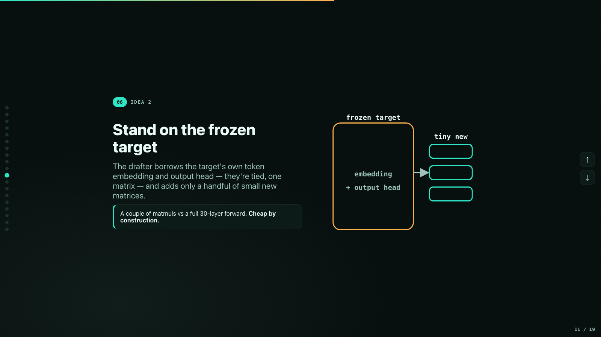

### ✏️ Task 5 — build it

Create `dspark_drafter.py`. Build in this order (full file in this repo):

1. **The parallel backbone** — `base_ctx` (summarise context), `pos_emb` (a
   learned offset per block position, so position 1 and position 5 start from
   different places), `base_mlp` (mix). Context = a cheap *mean of the last 8
   token embeddings* — no attention, that's what keeps it cheap.
2. **The low-rank Markov head** — `markov_down` / `markov_up`: embed the
   preceding token, push it through a rank-64 bottleneck, add it as a nudge to
   the base guess.
3. **Borrow the frozen target parts** — keep the target's embedding and
   `lm_head` as plain references (via `object.__setattr__`) so they are *not*
   registered as drafter parameters and never get trained.

```python
import torch
import torch.nn as nn
import torch.nn.functional as F

class DSparkDrafter(nn.Module):
    def __init__(self, target, block=5, markov_rank=64, window=8):
        super().__init__()
        dim = int(target.config.hidden_size)
        self.dim, self.vocab = dim, int(target.config.vocab_size)
        self.block, self.window = block, window

        # parallel backbone: ONE cheap pass -> a base hidden for ALL k positions
        self.base_ctx = nn.Sequential(nn.Linear(dim, dim), nn.GELU())
        self.pos_emb = nn.Parameter(torch.zeros(block, dim))
        self.base_mlp = nn.Sequential(nn.Linear(dim, dim), nn.GELU(), nn.Linear(dim, dim))

        # low-rank Markov head: a rank-r nudge driven ONLY by the preceding token
        self.markov_down = nn.Linear(dim, markov_rank, bias=False)
        self.markov_up = nn.Linear(markov_rank, dim, bias=False)

        self.head_norm = nn.LayerNorm(dim)
        self.conf_head = nn.Linear(dim, 1)   # per-position P(accept), for later

        # borrowed FROZEN target parts — plain refs, NOT registered as
        # parameters, so they are never trained
        object.__setattr__(self, "_emb", target.get_input_embeddings())
        object.__setattr__(self, "_lm_head", target.lm_head)
```

(You'll also want two small helpers — `window_of(ids)` grabs the last `window`
token ids, left-padded, and `_window_ctx` embeds them, means them, and runs
`base_ctx`. Both are a few lines; see the repo file.)

The core math, shared by training and inference:

```python
def _heads(self, ctx_win, prev_toks):
    """ctx_win (B,W) context tokens, prev_toks (B,k) -> logits (B,k,vocab)."""
    k = prev_toks.shape[1]
    ctx = self._window_ctx(ctx_win)                                    # (B,dim)
    bases = self.base_mlp(ctx[:, None, :] + self.pos_emb[None, :k, :]) # parallel
    adj = self.markov_up(F.gelu(self.markov_down(self._emb(prev_toks))))  # markov nudge
    h = self.head_norm(bases + adj)
    return self._lm_head(h), h                        # target's own output head
```

And the inference path — one backbone pass, then k tiny sequential steps where
each position sees only the token just drafted:

```python
@torch.no_grad()
def propose(self, ids, k):
    ctx = self._window_ctx(self.window_of(ids))
    bases = self.base_mlp(ctx[:, None, :] + self.pos_emb[None, :k, :])
    out, prev = [], ids[:, -1]
    for j in range(k):
        adj = self.markov_up(F.gelu(self.markov_down(self._emb(prev))))
        h = self.head_norm(bases[:, j, :] + adj)
        nid = self._lm_head(h).argmax(-1)
        out.append(nid)
        prev = nid          # Markov: next position sees this fresh token
    return torch.stack(out, dim=1)
```

**Checkpoint:** plug the *untrained* drafter into the chapter-2 verifier:

```bash
python -c "
from spec_decode import *
from dspark_drafter import DSparkDrafter
import torch
d = DSparkDrafter(target, block=5).eval()
ids = tok('def fibonacci(n):', return_tensors='pt').input_ids
base = plain_greedy(ids, 32)
out, st = speculative_greedy(ids, 32, d, k=5)
print('lossless:', torch.equal(base[:, :ids.shape[1]+32], out[:, :ids.shape[1]+32]))
print('stats   :', st)"
```

Measured here:

```
lossless: True
stats   : {'proposed': 32, 'accepted': 0, 'passes': 32}
```

It proposes garbage — 0 of 32 accepted — and the output is **still perfectly
lossless**. Correctness never depended on the drafter — now we're free to train
it however we like.

---

## Chapter 4 — Train it by distillation

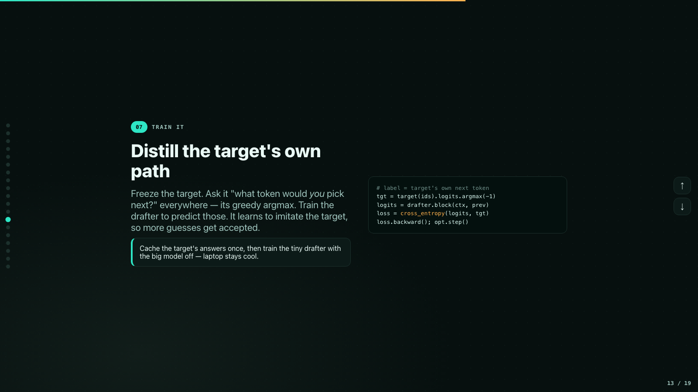

How do you train a drafter? **Distill.** Freeze the target; for a pile of text,
ask it "what token would YOU pick next?" at every position (its greedy argmax);
train the drafter with cross-entropy to predict those same tokens. It learns to
imitate the target's own path, so more guesses match and get accepted.

Two details that matter:

- **Teacher forcing makes training parallel.** At inference the Markov thread
  is sequential, but at training time we *know* the true previous tokens, so
  the whole block trains in one parallel forward — same math
  (`block_logits_teacher_forced`).
- **Heat-safe:** run the big target only **once per sentence** to cache its
  argmax labels (~50 passes total), then train the tiny 4M-param drafter for
  1500 steps with the target switched off.

### ✏️ Task 6 — train

Write a small corpus (`data.py`, ~50 short varied sentences) and
`train_drafter.py` (cache labels → sample random K-blocks with their context
windows → cross-entropy vs the target's picks → Adam, lr 2e-3, batch 16). Then:

```bash
python train_drafter.py     # ~1 min on CPU
```

Measured here:

```
caching target labels (one pass per sentence)...
cached 50 sentences

BEFORE training  accept=0%  passes=64/64
  step  250/1500  loss 0.259
  ...
  step 1500/1500  loss 0.143

AFTER  training  accept=28%  passes=47/64
(bigram baseline accept=41%  passes=39/64)

saved trained drafter -> drafter.pt
```

The untrained loss is ~12.9 (measured on the first batch — essentially random
guessing over a 49k-token vocabulary) and lands near 0.14; acceptance goes
**0% → ~30%**. Training did a real thing, and it saved `drafter.pt`. …but look
at that last line — the free bigram is at 41%. Let's measure this properly.

---

## Chapter 5 — Benchmark honestly (the dumb baseline wins)

The rule that separates research from marketing: **always benchmark against
the dumb baseline.** Ours is the free bigram from chapter 2.

### ✏️ Task 7 — the honest benchmark

Write `eval_accept.py` (full file in this repo): three drafters — bigram,
untrained DSpark, trained DSpark — on two prompt sets, REPETITIVE
(code/technical) and NOVEL prose the drafter has never seen. For every single
run, also run `plain_greedy` and assert the output is byte-identical. Report
acceptance rate and target passes used per 32 tokens.

```bash
python eval_accept.py
```

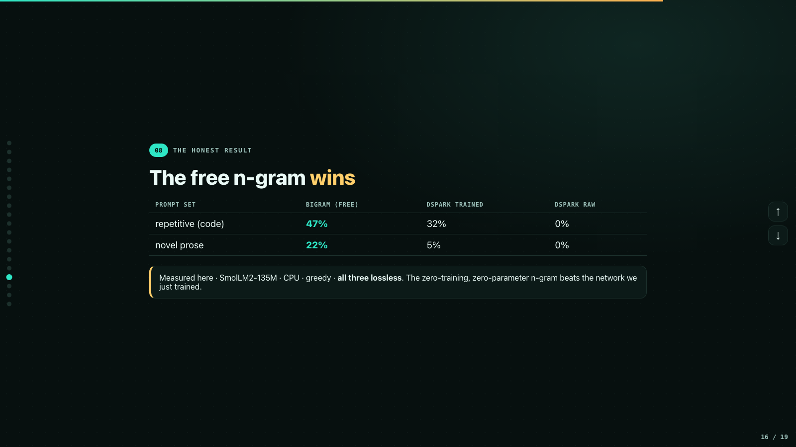

Measured here (SmolLM2-135M · CPU · greedy · all lossless):

```
=== REPETITIVE (n-gram's turf) — 4 prompts, 32 tokens each ===
drafter         accept   passes   vs plain  lossless
bigram            47%     73/128       43%  OK
dspark(raw)        0%    128/128        0%  OK
dspark(train)     32%     88/128       31%  OK

=== NOVEL prose (held-out) — 4 prompts, 32 tokens each ===
drafter         accept   passes   vs plain  lossless
bigram            22%    101/128       21%  OK
dspark(raw)        0%    128/128        0%  OK
dspark(train)      5%    121/128        5%  OK
```

The zero-training, zero-parameter n-gram **beats the neural drafter we just
trained. On both sets.**

### Why — and this is the actual lesson

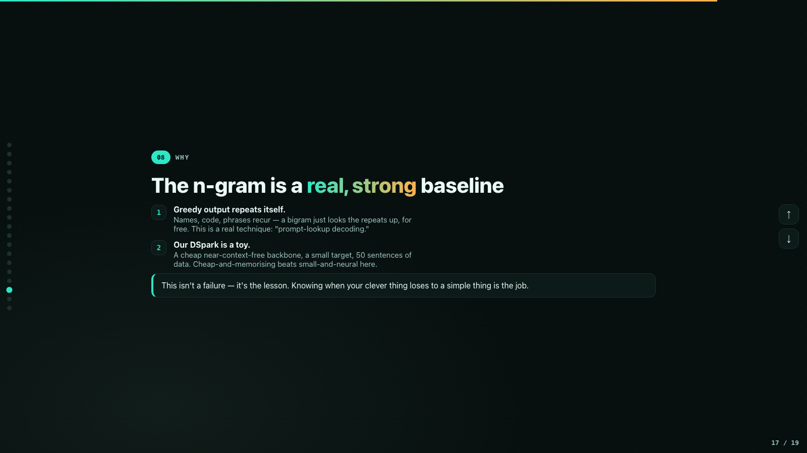

1. **A model's greedy output repeats itself** — names, code patterns, phrases —
   and a bigram built on the fly just looks those repeats up for free. This is
   a real technique with a name, **prompt-lookup decoding**, and it's shockingly
   strong for exactly this reason.
2. **Our DSpark drafter is deliberately a toy** — an almost context-free
   averaging backbone, a small target, 50 training sentences. On this setup,
   cheap-and-memorising beats small-and-neural.

### When the real DSpark wins

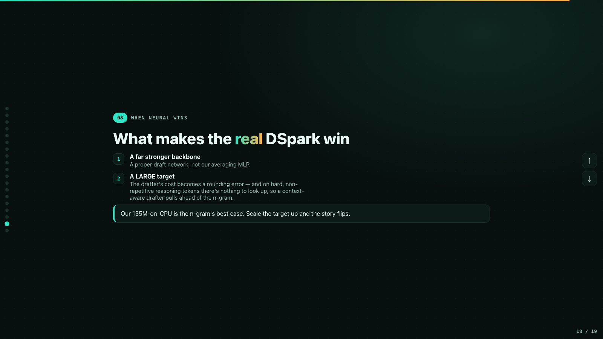

Exactly where DeepSeek uses it: a far stronger draft backbone than our
averaging MLP, and — the big one — a **large** target. When the target is huge,
the drafter's cost is a rounding error, and on hard non-repetitive reasoning
tokens (where there's nothing to look up) a trained drafter that understands
context pulls ahead of the n-gram. Our 135M-on-CPU setup is the neural
drafter's worst case, and it still learned to help. Scale the target up and the
story flips.

---

## What you built

- Speculative decoding from an empty file, with the **lossless guarantee
  proved**, not claimed — byte-identical to plain decoding no matter how bad
  the drafter is.
- DeepSeek's **DSpark drafter** from scratch: semi-autoregressive (one parallel
  backbone pass + a low-rank sequential Markov thread), reusing the frozen
  target's tied embedding/head.
- A **distillation loop** that trains it from the target's own greedy tokens:
  0% → 32% acceptance.
- An **honest benchmark** where the dumb baseline won — and you understand
  *why*. Knowing when your clever thing loses to a simple thing is the
  difference between using AI and doing research.

**Go further:** make the drafter beat the n-gram. A hybrid that consults both
and drafts with whichever is more confident (the `conf_head` is already in the
model) is a great place to start.

## Honest scope

Every number above is *measured here*: SmolLM2-135M, CPU, greedy decoding, toy
corpus. The paper's numbers are the paper's. This rebuilds the *mechanism* and
the lossless guarantee of [`deepseek-ai/DeepSpec`](https://github.com/deepseek-ai/DeepSpec)
(MIT) + the DSpark paper at toy scale — it is not affiliated with or endorsed
by its authors, and it does not reproduce their scale.
